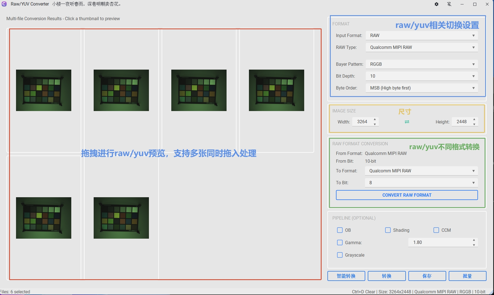
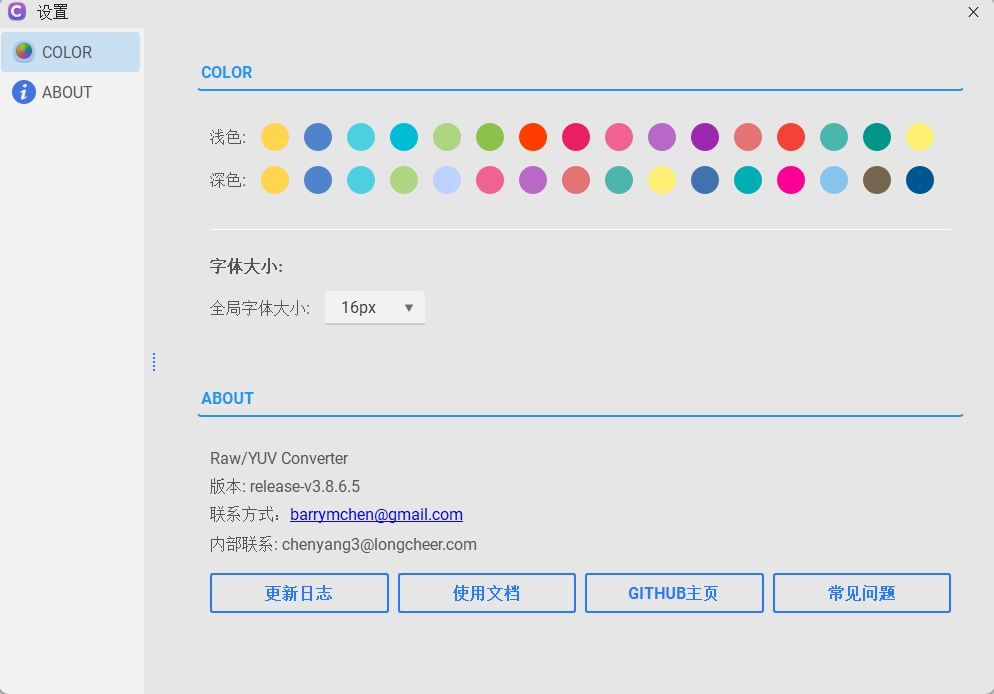

# AEBox Converter 使用指南

`aebox_conver.exe` 是一个面向日常调试与格式处理的 `RAW / YUV` 转换工具。它支持单文件预览、参数试错、批量转 JPG、RAW 格式互转、YUV 格式互转，以及通过拖拽快速加载文件。

本文档以“实际使用者”的角度编写，重点说明工具能做什么、该怎么用、哪些地方最容易踩坑。

## 1. 工具能做什么

### 1.1 预览与导出

- 支持将高通/MTK/展锐各种格式 `RAW` 或 `YUV` 文件按指定参数解码并预览。
- 支持将当前预览结果保存为 `JPG`。
- 支持同时拖入多个同类型文件进行网格预览，并批量保存为 `JPG`。
- 支持对整个文件夹做批量转图。

### 1.2 RAW 相关能力

- 支持手动设置 `宽 / 高 / Bayer / Bit Depth / Byte Order / RAW Type`。
- 支持 `智能转换`，自动尝试多组 `Bayer + Bit Depth + Byte Order` 组合，帮助快速判断正确解码参数。
- 支持可选的简单处理链：
  - `OB`
  - `Shading`
  - `CCM`
  - `Gamma`
  - `Grayscale`
- 支持 RAW 格式互转，并可同时做位深转换。

### 1.3 YUV 相关能力

- 支持多种 `YUV420 / YUV422 / YUV444 / 灰度 / 高位深` 格式解码。
- 支持将当前 YUV 重新编码为其他 YUV 格式。
- 支持将 YUV 预览或导出结果转为灰度图。

## 2. 支持的输入文件

### 2.1 常见扩展名

工具当前识别的常见输入扩展名包括：

- RAW 类：`.raw`、`.mipi`、`.rawmipi`、`.rawmipi10`、`.rawmipi12`、`.rawmipi16`、`.packed_word`、`.rawpalin16`、`.mipi_raw`
- YUV 类：`.yuv`、`.nv12`、`.nv21`

说明：

- 没有扩展名的文件也可能按 `RAW` 处理。
- `RAW / YUV` 不能混合拖拽到同一批次里；一次只建议处理同一种类型。

### 2.2 文件名自动识别能力

如果文件名中包含尺寸或位深信息，工具会自动尝试识别并填入界面参数。

支持的尺寸命名示例：

- `w[1280]_h[720]`
- `w1280_h720`
- `3264x2448`
- `1920x1080`
- `1280_720`

支持的位深命名示例：

- `rawmipi10`
- `rawmipi12`
- `rawmipi16`
- `10bit`
- `12bit`
- `16bit`
- `_10b`

## 3. 支持的 RAW 类型

界面中可选的 RAW 类型包括：

- `Qualcomm MIPI RAW`
- `MTK Unpacked RAW`
- `MTK Packed Word`
- `MIPI RAW`
- `Unisoc MIPI RAW`
- `HiSilicon RAW`
- `Rockchip RAW`
- `Samsung RAW`
- `Ambarella RAW`
- `Novatek RAW`
- `NXP RAW`
- `TI RAW`
- `Fullhan RAW`
- `Sigmastar RAW`

位深支持规则：

- `Qualcomm MIPI RAW / MIPI RAW / Unisoc MIPI RAW`：支持 `8 / 10 / 12 / 16 bit`
- `MTK Unpacked RAW / MTK Packed Word` 以及其他扩展平台 RAW：支持 `8 / 10 / 12 / 14 / 16 bit`

## 4. 支持的 YUV 类型

YUV 下拉框支持的格式很多，覆盖了以下几大类：

- 灰度格式：如 `Y8 / Grayscale`、`Y16 LE`、`Y16 BE`、`V4L2 GREY`
- YUV420：如 `I420`、`YV12`、`NV12`、`NV21`、`P010`、`P012`、`P016`
- YUV422：如 `YUYV`、`UYVY`、`YVYU`、`VYUY`、`I422`、`NV16`、`NV61`、`Y210`
- YUV444：如 `I444`、`NV24`、`NV42`、`Y410`、`Y416`
- 部分 V4L2 / Vendor private 格式

说明：

- 某些 `Vendor private` 项属于“尽力兼容”的预览方式，适合试读，不代表一定能完全正确还原厂商私有布局。
- YUV 互转时，目标格式列表会自动过滤掉不可直接编码的私有格式。

## 5. 快速上手

### 5.1 打开文件预览

1. 运行 `aebox_conver.exe`。
2. 选择输入格式：`RAW` 或 `YUV`。
3. 点击“打开文件”，或直接把文件拖入窗口。
4. 检查并修正参数：
   - RAW：`RAW Type / Bayer / Bit Depth / Byte Order / Width / Height`
   - YUV：`YUV Type / Width / Height`
5. 工具会自动预览；如果没有自动触发，可点击“转换”。
6. 预览正确后点击“保存”，导出为 `JPG`。

### 5.2 拖拽多个文件预览

1. 将多个同类型文件直接拖入窗口。
2. 工具会以网格形式显示结果。
3. 点击缩略图可查看大图。
4. 点击“保存”可把当前这一批结果统一导出为 `JPG`。

说明：

- 多文件拖拽适合同一批参数的快速检查。
- 如果这一批文件里有些参数并不一致，结果会出现部分正确、部分错误的情况，需要分批处理。

### 5.3 目录批量转 JPG

1. 先在界面上设置好当前批次使用的参数。
2. 点击“批量”。
3. 选择包含待处理文件的文件夹。
4. 工具会将该文件夹下当前层级的匹配文件批量转为 `JPG`。

批量功能特点：

- 输出目录就是输入目录本身。
- 输出文件名默认为“原文件名同名 `.jpg`”。
- 只扫描当前文件夹，不递归处理子目录。
- 批量时不会按文件逐个自动识别格式参数，而是统一使用你当前界面上的参数。

## 6. RAW 使用说明

### 6.1 常规 RAW 预览

适用场景：

- 已知图像尺寸
- 已知 Bayer
- 已知位深
- 需要快速确认解码是否正确

推荐流程：

1. 先确认 `Width / Height`。
2. 选择最接近实际来源的 `RAW Type`。
3. 设置 `Bit Depth`。
4. 如果是 MIPI 类 RAW，再确认 `Byte Order`。
5. 如果颜色不对，再切换 `Bayer Pattern`。

### 6.2 智能转换

`智能转换` 适合以下场景：

- 只知道文件大概是 RAW，但 Bayer 不确定
- 不确定应按 `MSB` 还是 `LSB` 解码
- 不确定当前位深是否设置正确

行为说明：

- 该功能只支持单个 `RAW` 文件。
- 运行时会询问是否尝试多种位深。
- 工具会组合尝试：
  - `RGGB / BGGR / GRBG / GBRG`
  - `MSB / LSB`
  - 当前位深或多位深模式
- 所有结果会显示在网格中，方便人工挑选最正确的一张。
- 可以右键某个结果：
  - 应用该配置回主界面
  - 保存该结果
  - 预览该结果

适合经验用户快速“试参找对图”，不适合替代正式的格式确认。

### 6.3 Pipeline 选项

RAW 预览阶段可勾选以下处理：

- `OB`：黑电平扣除
- `Shading`：镜头阴影补偿
- `CCM`：颜色校正矩阵
- `Gamma`：伽马调整
- `Grayscale`：灰度显示

注意：

- 这些选项主要用于快速观察效果，不等同于完整 ISP 链路。
- 若你的目标是“判断原始 RAW 是否解码正确”，建议先全部关闭，先确认基础图像是否正常。

## 7. RAW 格式互转

### 7.1 适用方式

界面中的 `RAW Format Conversion` 用于把当前加载的 RAW 从一种封装格式转成另一种封装格式，并可同步调整位深。

典型用途：

- `Qualcomm MIPI RAW` 转 `MTK Unpacked RAW`
- `MTK Packed Word` 转 `Qualcomm MIPI RAW`
- `10 bit` 转 `12 bit`

### 7.2 当前真实支持范围

虽然下拉框列出了很多 RAW 类型，但当前 RAW 互转逻辑真正支持的源/目标格式主要是：

- `Qualcomm MIPI RAW`
- `MIPI RAW`
- `Unisoc MIPI RAW`
- `MTK Unpacked RAW`
- `MTK Packed Word`

也就是说：

- 其他平台 RAW 类型目前更适合用于“读取预览”
- 不建议把 `HiSilicon / Rockchip / Samsung / Ambarella / Novatek / NXP / TI / Fullhan / Sigmastar` 当成稳定可用的 RAW 互转目标

### 7.3 使用建议

- 做 RAW 互转前，先确认当前文件已经能被正确预览。
- 位深转换本质上会做数值缩放，不是无损拷贝。
- 若目标链路对字节序或行对齐很敏感，转换后仍建议用真实接收端再验证一次。

## 8. YUV 格式互转

`YUV Format Conversion` 用于把当前 YUV 文件转成另一种 YUV 布局。

适合场景：

- `I420` 转 `NV12`
- `NV21` 转 `YUYV`
- 灰度格式之间转换

使用步骤：

1. 先加载一个单独的 YUV 文件。
2. 选择正确的源格式和尺寸。
3. 在 `To Format` 中选择目标格式。
4. 点击 `Convert YUV Format`。
5. 选择输出路径。

注意：

- 该功能目前仅支持单文件转换。
- 如果源格式选错，后续转换结果也会跟着错。
- 某些私有格式只能“尽力读”，不保证能稳定再编码回等价格式。

## 9. 保存与输出规则

### 9.1 单文件保存

- 单文件预览后点击“保存”，默认保存为 `JPG`。
- 保存的是当前界面所见结果，包含你当前启用的灰度或 RAW pipeline 效果。

### 9.2 多文件保存

- 多文件拖拽后点击“保存”，会要求选择一个输出目录。
- 输出文件名默认为各自原文件名的同名 `.jpg`。

### 9.3 批量目录转换

- 点击“批量”后，输出目录固定为所选输入目录。
- 输出文件名为 `原文件名.jpg`。
- 如果目标目录下已存在同名 `JPG`，有被覆盖的风险，建议先备份或先换目录测试。

## 10. 快捷操作

- `Ctrl + A`：旋转当前预览图像
- `Ctrl + D`：清空当前已加载文件

拖拽相关：

- 支持把文件直接拖进主窗口
- 支持多文件拖拽
- 不支持同一批次同时拖入 RAW 和 YUV

## 11. 参数设置建议

### 11.1 文件能打开，但图像花屏/偏色

优先检查：

1. `Width / Height` 是否正确
2. `Bit Depth` 是否正确
3. `RAW Type` 是否选对
4. `Byte Order` 是否应切换为 `MSB` 或 `LSB`
5. `Bayer Pattern` 是否选错

### 11.2 图像结构看起来对，但颜色明显异常

优先尝试：

- 切换 `Bayer Pattern`
- 关闭 `CCM / Gamma / Grayscale`
- 确认是否误把 YUV 当成 RAW，或误把 RAW 当成 YUV

### 11.3 预览正常，批量结果异常

通常原因：

- 批量转换使用的是当前界面统一参数
- 同一文件夹中的文件并不完全同规格
- 文件夹里混入了不同来源的 RAW / YUV

建议：

- 先拿同批次中的 1 张试通参数
- 再只对同规格文件做批量

## 12. 使用注意事项

### 12.1 关于自动识别

- 工具会尽量从文件名推断尺寸和位深，但这只是辅助，不保证一定正确。
- 特别是 `.raw` 这类通用扩展名，不会自动帮你完全判断真实封装格式。

### 12.2 关于扩展名与真实格式

- 扩展名只是线索，不是标准答案。
- 例如同样叫 `.raw`，实际可能是：
  - unpacked raw
  - packed raw
  - mipi raw
  - 厂商私有对齐格式

### 12.3 关于厂商私有格式

- 某些厂商或驱动私有布局在界面中可以试读，但不代表一定能精确解码。
- 尤其是 tiled、compressed、vendor private 这类格式，建议只把该工具当作辅助排查工具。

### 12.4 关于性能

- 大尺寸 RAW、多图同时拖拽、智能转换多位深模式，都会明显增加耗时。
- 智能转换是“穷举试参”，结果多时属于正常现象。

### 12.5 关于设置记忆

工具会保存最近一次使用参数，配置文件位置为：

`app_cache/aebox_converter/settings.json`

如果你发现参数总是“自动恢复成上次值”，这不是异常，是工具的设计行为。

## 13. 推荐使用习惯

为了减少误判，建议按下面的顺序使用：

1. 先单文件预览，确认尺寸和格式参数。
2. 再用 `智能转换` 找到最可信的一组 RAW 参数。
3. 参数确认无误后，再做：
   - 单张保存
   - 多文件保存
   - 文件夹批量转换
   - RAW / YUV 互转

对不确定来源的文件，先把 pipeline 全关掉，优先验证“基础解码是否正确”，再考虑增强处理。

## 14. 截图位置

可在下面补充你自己的界面截图：

- 主界面截图
- RAW 参数区截图
- 智能转换结果网格截图
- YUV 格式转换截图
- 批量转换截图

---

如果后续你还想补一版“更面向普通用户”的极简版 README，我也可以再帮你压缩成一页式说明。
